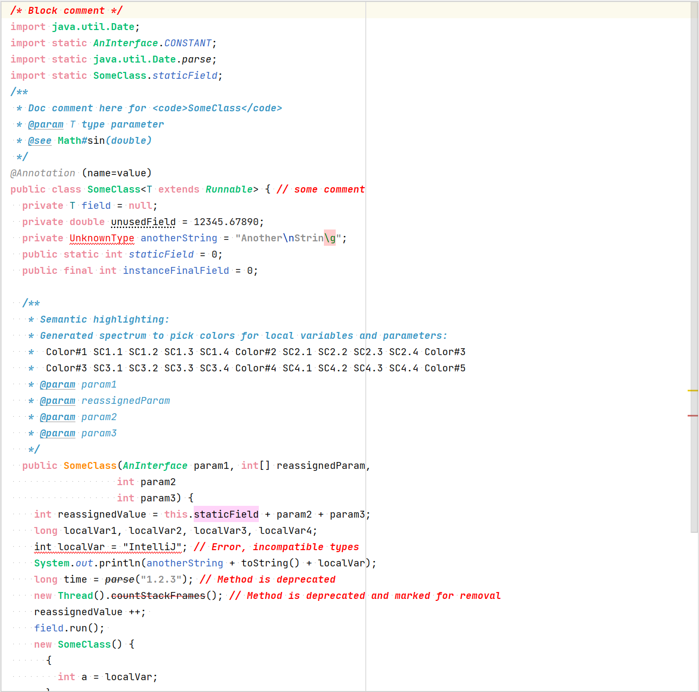

# Captainsoft's Source Code Color Coding Scheme
The original source code color coding scheme for use in Intellij as provided
by the developers from Captainsoft.

### How it looks

### How it works
Simply import the `captainsoft_color_scheme.icl` file under 
`Settings->Editor->Color Scheme` in IntelliJ.

## About the author
[Mathias Fringes](https://www.linkedin.com/in/mathias-fringes-b2015011/)  
[Captainsoft Entertainment](http://www.captainsoft.de/)

## LICENCE
MIT